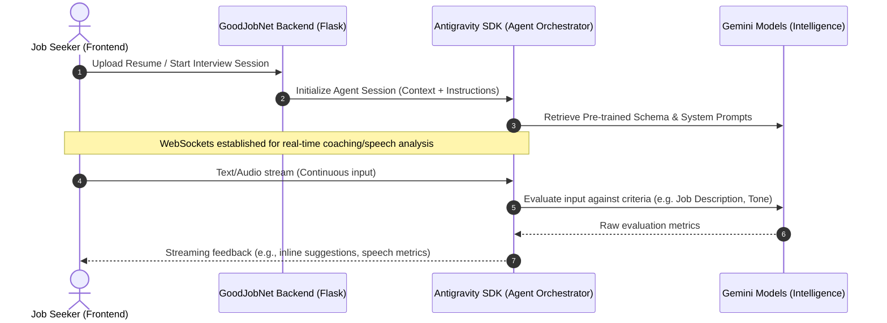

# GoodJobNet Concept Exploration: Antigravity SDK Integration

This document outlines a high-level architectural and design concept for integrating the **Antigravity SDK** into the GoodJobNet platform. This integration introduces two agentic AI capabilities designed to empower job seekers:
1. **Virtual Resume Review & Revision Assistant**
2. **Virtual Job Interview Coach**

---

## Architectural Concept

The Antigravity SDK acts as an orchestrator for Large Language Models (LLMs) and real-time audio/text processing. The integration model follows a hybrid real-time architecture:



---

## 1. Virtual Resume Review & Revision Assistant

This assistant reviews user-uploaded resumes (`PDF`/`DOCX`) and compares them against matching job postings in the GoodJobNet Job Bank. It goes beyond simple grammar checks by rewriting sections to emphasize key skills dynamically.

### Key Capabilities
- **Job Bank Matching**: Scans the available listings in the Job Bank and highlights how well the resume matches the target role.
- **Inline Revision Suggestions**: Uses standard text-differencing to show exact wordings to replace (e.g., changing passive verbs to action verbs).
- **Resume Score Meter**: Generates a dynamic strength score based on readability, impact, formatting, and relevance.

### Mock API Protocol (Resume Analysis)
```json
// POST /api/v1/resume/analyze
{
  "resume_text": "Experienced custodian looking for a stable warehouse or janitorial job...",
  "target_job_type": "Custodian",
  "job_bank_postings": [
    {
      "company": "Orlando Theme Park",
      "available_jobs": "Custodian",
      "requirements": "High attention to detail, chemical safety awareness, self-motivated"
    }
  ]
}

// Response
{
  "score": 85,
  "suggestions": [
    {
      "section": "Experience",
      "original": "Cleaned floors and took out trash.",
      "suggested": "Maintained sanitation standards across high-traffic park areas, managing chemical safety compliance.",
      "rationale": "Aligns with Orlando Theme Park's 'chemical safety' and 'attention to detail' requirements."
    }
  ]
}
```

---

## 2. Virtual Job Interview Coach

The Virtual Interview Coach conducts simulated mock interviews tailored to a specific job listing in the database. Using real-time audio and text analysis, it evaluates both content and delivery.

### Key Capabilities
- **Role-Specific Scenarios**: Generates questions based on actual job requirements (e.g., asking safety questions for CDL Drivers, accounting questions for Bookkeepers).
- **Speech Delivery Metrics**: Tracks pacing (words per minute), filler-word usage ("um", "like"), and tone.
- **Digital Interviewer Avatar**: Provides a friendly, low-latency conversational avatar that speaks questions aloud using the Web Speech Synthesis API.

---

## Interactive Concept Mockup

Below is a premium dark-mode dashboard mockup showcasing these two features integrated directly into the GoodJobNet workspace.


---

## Concept Feasibility Analysis

### Technical Requirements
- **Websockets (flask-socketio)**: Necessary for the real-time feedback loops required during the interview coaching (audio/speech streams).
- **Document Parsers (`PyPDF2`/`python-docx`)**: Needed on the backend to extract text for the Resume Assistant.
- **Antigravity SDK Core API**: An API key and secure environment variables to communicate with Gemini models.

### Recommended Next Steps for Prototyping
1. **Resume Parser Route**: Implement a simple file upload in `app.py` that parses text and sends it with a basic system prompt to an LLM.
2. **WebRTC/WebAudio Integration**: Build a frontend component that records audio and utilizes the Web Speech Recognition API to capture answers, running local evaluation on pacing before communicating with the server.
